<head>
		<meta charset="utf-8">
		<link rel="stylesheet" href="style.css">
		
</head>

<h1>Projeto:</h1>

<h3>Requisições e Respostas para Projeto</h3>

	
Cadastro de um projeto: 

	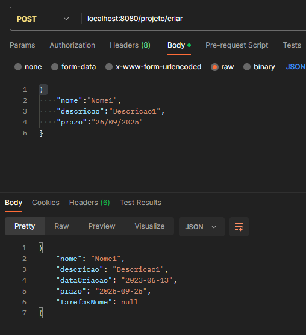	

Detalhar os dados de um projeto através de seu ID: 

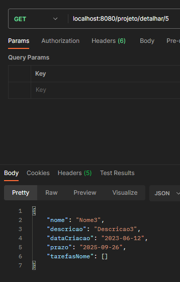

Listar todos os projetos e mostrar seus dados: 

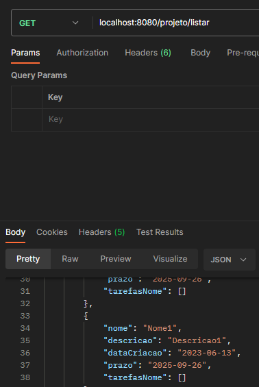

Editar os dados de um projeto pelo seu ID: 

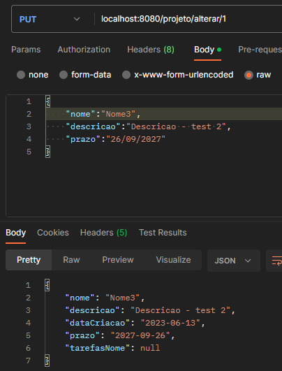

Apagar projeto através de seu ID: 

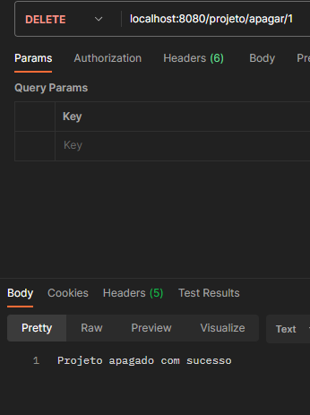

<h3>Requisições e Respostas para Tarefa</h3>

	
Cadastro de uma tarefa a partir do id de um projeto: 

	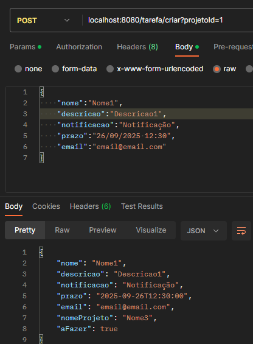

Detalhar os dados de uma tarefa através de seu ID: 

	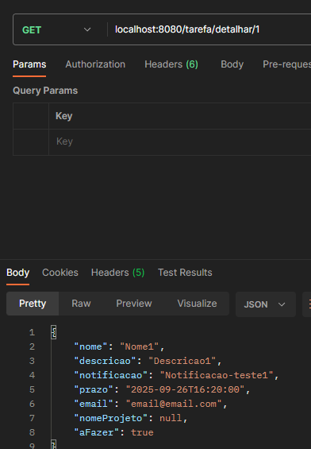

Listar todos as tarefas e mostrar seus dados: 

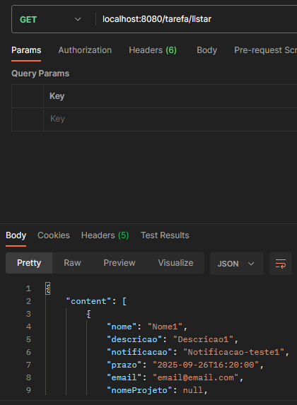

Editar os dados de uma tarefa pelo seu ID: 

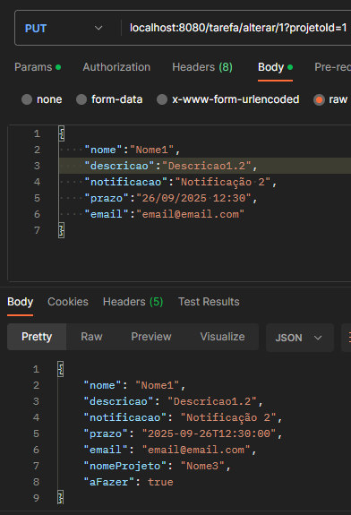	

Marcar uma tarefa concluída com seu ID: 

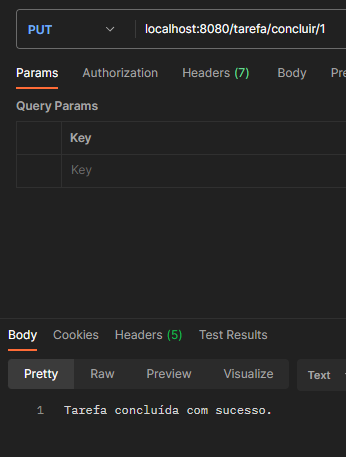

Apagar tarefa através de seu ID: 

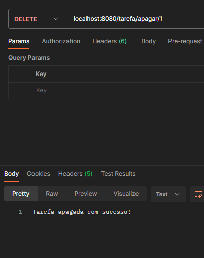

<h3>Requisições e Respostas para Usuário</h3>

	
Cadastro de um usuário: 

	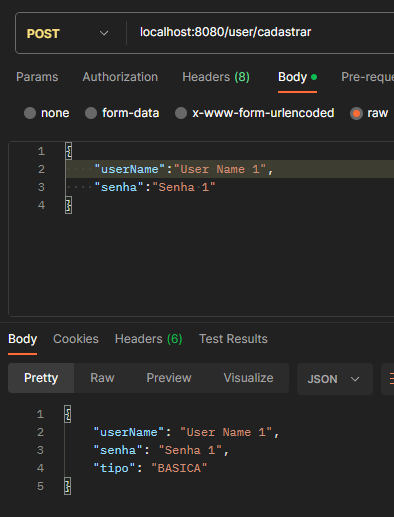

Detalhar os dados de um usuário através de seu ID: 

	

Listar todos os usuário e mostrar seus dados: 

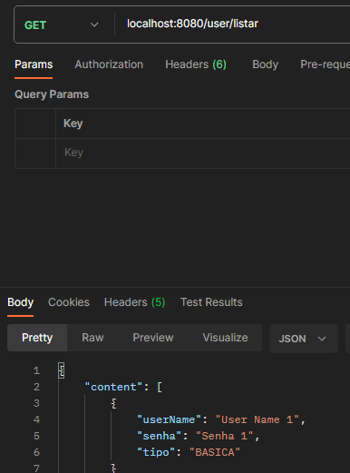

Editar os dados de um usuário pelo seu ID: 

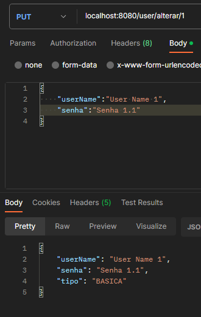	

Apagar usuário através de seu ID: 

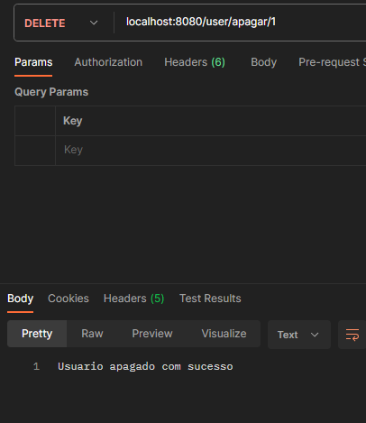

